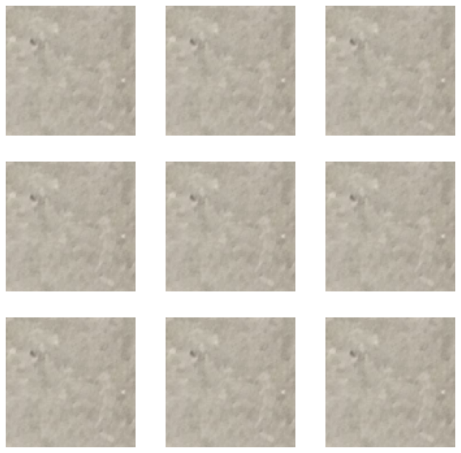
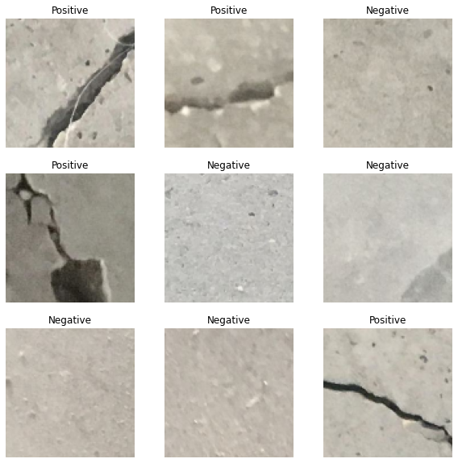
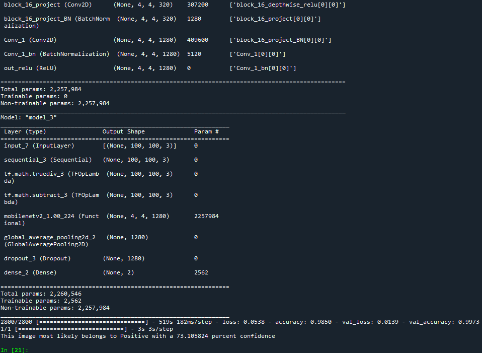

# Github Project 3 - Prediction of Concretes with Cracks

 1. You are tasked to perform image classification to classify concretes with cracks

 2. Link to dataset:
    
    https://data.mendeley.com/datasets/5y9wdsg2zt/2

 3. You may apply transfer learning.
 
 ⚡️ Sample train data (Before)
 
 
 ⚡️ Sample trained data (After)
 
 
 ⚡️ Image to be predicted
 
 
 ⚡️ Result
 
